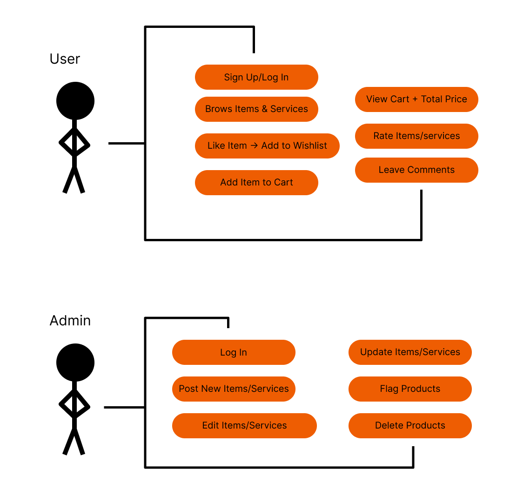

#  Great Minds Technologies – Hit Me Up

##  Table of Contents

1. [About the Project](#1-about-the-project)
   - 1.1 [Project Description](#11-project-description)
   - 1.2 [Built With](#12-built-with)
2. [Getting Started](#2-getting-started)
   - 2.1 [Prerequisites](#21-prerequisites)
   - 2.2 [How to Install](#22-how-to-install)
3. [Features and Usage](#3-features-and-usage)
   - [Screenshots & Explanations](#screenshots--explanations)
4. [Demonstration Video](#4-demonstration-video)
5. [Architecture / System Design](#5-architecture--system-design)
6. [Unit Testing and User Testing](#6-unit-testing-and-user-testing)
7. [Highlights and Challenges](#7-highlights-and-challenges)
8. [Roadmap – Future Improvements](#8-roadmap--future-improvements)
9. [Contributing and License](#9-contributing-and-license)
10. [Authors and Contact Info](#10-authors-and-contact-info)
11. [Acknowledgements](#11-acknowledgements)

---

## 1. About the Project

### 1.1 Project Description

**Hit Me Up** is a fictional, dark-humored web application for an underground hitman-for-hire network. The app allows users to create an account, log in securely, and browse or book hitmen services or purchase weapons. Styled with an edgy, underground aesthetic, it balances humor, creativity, and full-stack functionality.

This project was created to demonstrate advanced web development skills, specifically full-stack architecture, user authentication, dynamic routing, and professional UI/UX design.

**Who it's for:** Developers, students, or instructors exploring secure login systems, modern front-end architecture, and API integration.

**Why it exists:** As part of an educational assignment, this app satirically demonstrates how full-stack apps work while reinforcing professional development workflows.

### 1.2 Built With

#### Frontend


#### Backend


**API:**

   Our custom API was developed with Express.js and Mongoose, allowing us to define models, routes, and controller logic that handled data related to users, hitmen, and weapons.

  API supported full CRUD operations, enabling secure and dynamic interaction between the frontend and the database through RESTful endpoints.

   Password security was ensured using bcrypt, following best practices in real-world development environments.

   This shift reinforced our understanding of building secure, scalable, and production-ready APIs tailored to the needs of the application.

---

## 2. Getting Started

### 2.1 Prerequisites

- Node.js (v14+)
- npm
- MongoDB (local or hosted instance)
- Git

### 2.2 How to Install

1. **Clone the Repository**

```bash
git clone https://github.com/your-username/hit-me-up.git
```

2. **Install Frontend**

```bash
cd frontend
npm install
npm start
```

3. **Install Backend** 

Open a new terminal:

```bash
cd backend
npm install
npm start
```

---

## 3. Features and Usage

-  **User Authentication**: We implemented a secure sign-up and login system using express sessions and bcrypt for hashing user passwords. This ensures that only authenticated users can access routes such as the cart, wishlist, and administrator functions
-  **Product Viewing**: Users can browse products and hitman services stored on our mongodb database
-  **Dark-Themed UI**: The design embraces a dark, edgy visual identity to match the satirical, underground concept of the project. The styling uses a mix of custom CSS, React-Bootstrap, minimal animations to maintain usability while establishing a strong brand personality. The layout is responsive for both desktop and mobile devices.
-  **Modular Architecture**: The frontend follows a component-based architecture to follow best practices in programming modular systems. This improves readability, scalability, and maintainability. The structure also allows for quick updates or the addition of new features with minimal disruption to existing code.
-  **React Router**: Seamless route management powered by react-router
- **Administrative Functionality**: The web application includes admin limited functionality such as adding, deleting, and reviewing products.

### Screenshots & Explanations

Home page


Shop page

About us page

Footer

Login/Register

Add Product

Reviews on Individual Product

Admin Approve/Deny Product


---

## 4. Demonstration Video

[🔗 Watch Here](https://drive.google.com/file/d/18gUZrLTv2NoHnUCgmJriBdeoa2ODZp6C/view?usp=sharing)

---

## 5. Architecture / System Design

- **Frontend**: Component-based architecture built with React
- **Routing**: React Router DOM for client-side route management
- **State Management**: Local state + JWT token storage in localStorage
- **Backend**: Express.js REST API
- **Database**: MongoDB with Mongoose ODM

#### System Diagrams




---

## 6. Highlights and Challenges

### Highlights

- Working in a good team with strong collaboration
- Creating our own database
- Learning how to implement encryption
- Developing modular components that can be easily implemented where needed
- Successfully setting up administrative functions.

### Challenges

- Integrating API calls
- Setting up express sessions
- Always having login displayed for some reason
- API timeouts (error catching)
- Backend route validation and error catching (again)
- Difficulty planning of object schemas

---

## 7. Roadmap – Future Improvements

- Add payment gateway integration
- Vendor functionality to add and edit their own products
- Expand upon user profiles
- Improved Error logging and monitoring
- Improved backend 

---

## 8. Contributing and License

Any contributions to this project are **greatly appreciated!** It inspires us and helps us all learn! To add any contributions follow these steps :)

1. Fork the repository
2. Create a feature branch: `git checkout -b feature-name`
3. Commit your changes: `git commit -am 'Add feature'`
4. Push to the branch: `git push origin feature-name`
5. Open a pull request

---

### 9. License

Distributed under the MIT License.

---

## 10. Authors

- Kai Barker – Frontend and Backend Developer – [Kai-Barker](https://github.com/Kai-Barker)
- Danae Swart – Frontend and Backend Developer – [danaeswart](https://github.com/danaeswart)
- Onthatile Lesufi – Frontend and Backend Developer – [Onthatile-Lesufi](https://github.com/Onthatile-Lesufi)

Feel free to reach out for questions, feedback, or collaboration opportunities.

---

## 11. Contact Info

- Kai Barker – [241065@virtualwindow.co.za](mailto\:241065@virtualwindow.co.za)
- Danae Swart – [your.email@example.com](mailto\:your.email@example.com)
- Onthatile Lesufi – [your.email@example.com](mailto\:your.email@example.com)

---

## 12. Acknowledgements

- [Tsungai Katsuro](https://github.com/TsungaiKats)
- StackOverflow
- OpenAI and Chatgpt
- Microsoft and Copilot
- MDN Web Docs
- Bootstrap and React documentation

